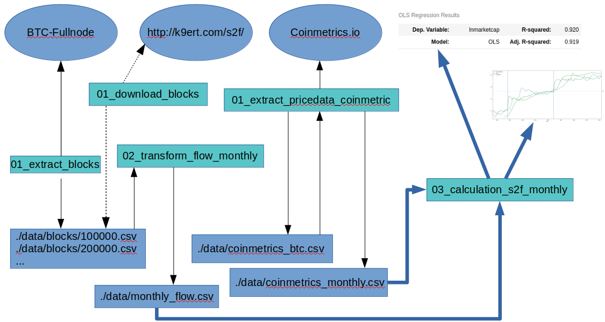

# Introduction
This repo is modeling the price of btc based on PlanB's original S2F-model but based on python and jupyter Notebooks.
It's an educational resource which should demonstrate the use of Open Source tools in order to do bitconometrics.

To use this, you need:
* The willingness to work on the commandline
* a bit of programming experience or the willingness to learn it as you go
Consider to check the slides shich are stored in this repository.

This diagram illustrates how the scripts work together.


# The scripts
At the top you see the services which provide the data. The green rectangles represents the scripts which connect to the services and write intermediate files which are represented by blue rectangles at the bottom.
The bold blue arrows represents the last step of the script which is doing the heavy lifting after the other scripts prepared the data.

## [01_extract_blocks.ipynb](01_extract_blocks.ipynb)
* connects to a fullnode 
* extracts all the blocks to files in ./data
* Currently that is done in chunks which need to be manual adjusted in the code as this is a very long running process
* Processing the whole Chain takes quite some time. Depending on your Fullnode 10-12h.

## [01b_download_blockdata.iypnb](01b_download_blockdata.iypnb)
* As many are not interested in getting the raw data from a fullnode, this notebook simply downloads pre-generated block-data-files.
* Run this initially if you don't want to extract the blocks yourself.

## [02_transform_flow_monthly](02_transform_flow_monthly.ipynb)
* Loads the data/blocks*.csv files
* resamples the data down to monthly values summing up the flows

## [03_extract_pricedata_coinmetric](03_extract_pricedata_coinmetric.ipynb)
* Downloads the pricedata from bitstamp if it's not yet downloaded
* Resamples the pricedata to monthly data so that it can potentially be used for s2f calculation-cases

## [04_caclulation_s2f_monthly.ipynb](s2f-monthly/04_caclulation_s2f_monthly.ipynb)
* This script is the only one specific to s2f-monthly and therefore it's located in that directory
* loads the monthly flow-data in the main-table
* calculates the stock and the s2f based on lost-coin-assumptions all in the main-table
* loads the pricedata from coinmetrics and the one coming from PlanB which is available in data/planb_s2f_pricedata.csv all in the main-table
* calculates marketcap and the two ln-values of markectcap and s2f
* Calculates the regression, shown the graph and calculates some estimations

# How to use this

## Get Python 3
As a windows-user, you have two options. Either you're installing the [Windows Subsystem for Linux](https://docs.microsoft.com/en-us/windows/wsl/install-win10) and then continue as if you would use Linux.
The other alternative is installing a windows-specific version of python: [Anaconda](https://problemsolvingwithpython.com/01-Orientation/01.03-Installing-Anaconda-on-Windows/). Here is also a reasonable [video](https://www.youtube.com/watch?v=LrMOrMb8-3s).

## Get all the files
You're probably reading this on a "github-repository-page". You can either use git to clone this repository or you're simply downloading the content with this [link](https://github.com/k9ert/bitconometrics/archive/master.zip).


## Install prerequistes
It's good practice to use a "virtualEnv" for python projects. There are lots of libraries in lots of versions existing. In order to not get conflicting dependencies for different projects, one creates virtual-environments 
where only the dependencies for that specific project are installed. 

```
cd bitconometrics         # change the directory to where you've unzipped the package above
python3 -m venv .env      # Creating an empty virtual Environment in a 
                          # hidden directory (files/dirs with a ".")
source ./.env/bin/activate # Activating the environment by sourcing that file
                          # which will modify the Env-Var PATH and so on
pip3 install cryptoadvance.specter numpy pandas pandas_datareader statsmodels jupyter matplotlib
                          # Installing the needed packages into the environment
```

This might work a bit different when working with Anaconda.

## Starting jupyter

```
cd bitconometrics         # change the directory to where you've unzipped the package above
. ./.env/bin/activate     # You always have to activate your environment (if you haven't done so)
jupyter notebook          # This will start the server and open the browser
```
Here are [some hints](https://medium.com/@harshityadav95/jupyter-notebook-in-windows-subsystem-for-linux-wsl-8b46fdf0a536) for getting it to work with WSL. 